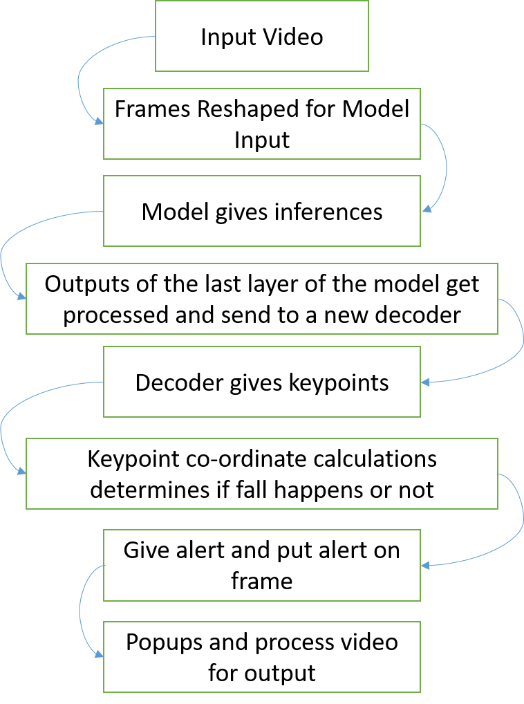

# Real-Time Patient Fall Detection System

This repo is for Real-Time Patient Monitoring Dashboard paper submission in Intel IEEE INDICON 2024.

## Pose Estimation

This project runs pose estimation on a video source using command-line arguments.

### Requirements

- Python 3.x
- Required Python packages (install using `pip install -r requirements.txt`)

### Usage

To run the pose estimation, use the following command:

```
python main.py --source <video_source> [options]

Arguments:
--source, -s (required): Path to the video source.
--flip: Flip the video horizontally.
--use_popup: Use a popup window for display.
--draw: Draw the pose estimation on the video.
--fps: Frames per second for the output video (default: 60).
--out: Output the processed video.
--output_video_path: Path to save the output video.
--video_name: The output video file name.

Example:
python main.py --source test/test4.mp4 --use_popup --fps 60 --out --output_video_path /demo --video_name output

or

python main.py -s test/test4.mp4 --use_popup --fps 60 --out --output_video_path /demo --video_name output
```

### Wrokflow

1. Load the video source.
2. Read the video frame by frame.
3. Detect the pose estimation using the OpenPose model.
4. Draw the pose estimation on the video.
5. Display the video with the pose estimation.
6. Save the processed video if required.



### References

- [OpenPose Paper](https://arxiv.org/pdf/1812.08008)
- [OpenPose Python Notebook](https://github.com/openvinotoolkit/openvino_notebooks/tree/latest/notebooks/pose-estimation-webcam)
- [OpenPose Python](https://github.com/openvinotoolkit/open_model_zoo/tree/master/models/intel/human-pose-estimation-0001)
- [OpenVino Docs](https://docs.openvino.ai/2024/notebooks/pose-estimation-with-output.html)


### License

This project is licensed under the MIT License.
